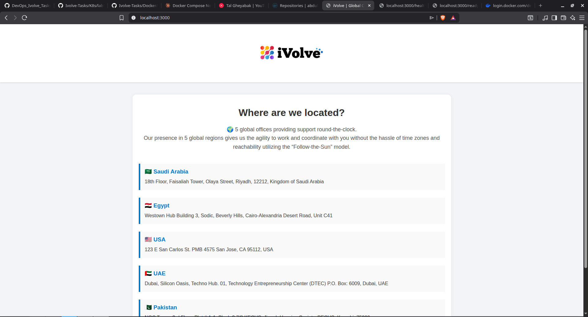
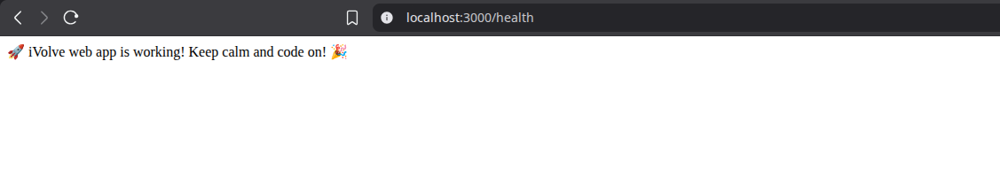
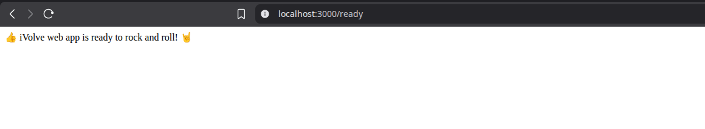
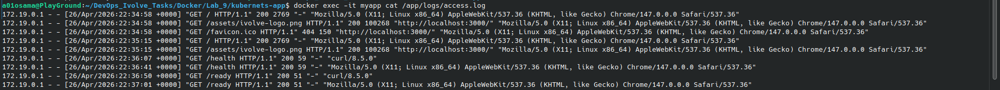
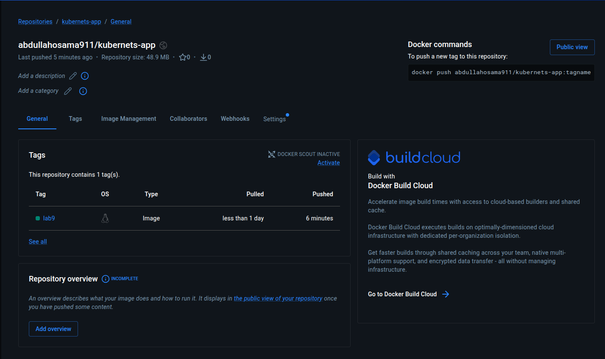

# Lab 9: Containerized Node.js and MySQL Stack Using Docker Compose

This lab demonstrates how to containerize a Node.js application with a MySQL database using Docker Compose, configure environment variables, persist database data using volumes, and verify application health and logs.

---

## Prerequisites

- Docker
- Docker Compose
- Git
- DockerHub account

---

## Step 1: Clone the Application Repository

```bash
git clone https://github.com/Ibrahim-Adel15/kubernets-app.git
cd kubernets-app
```

---

## Step 2: Application Requirements

- Application runs on port **3000**
- Requires MySQL database named `ivolve`
- Uses environment variables for database connection:
  - `DB_HOST`
  - `DB_USER`
  - `DB_PASSWORD`

---

## Step 3: Create `docker-compose.yml`

Create a file named `docker-compose.yml` in the project root:

```yaml
version: "3"
services:

  app_service:
    build: .
    container_name: myapp
    ports:
      - "3000:3000"
    environment:
      DB_HOST: mysql_db
      DB_USER: root
      DB_PASSWORD: root
    depends_on:
      - db_service

  db_service:
    image: mysql:8.0
    container_name: mysql_db
    environment:
      MYSQL_ROOT_PASSWORD: root
      MYSQL_DATABASE: ivolve
    volumes:
      - db_data:/var/lib/mysql

volumes:
  db_data:
```

> **Note:** The `depends_on` directive ensures the app service waits for the database service to start before launching.

---

## Step 4: Build and Run the Stack

```bash
docker compose up -d --build
```

This command will:
1. Build the Node.js app image from the local `Dockerfile`
2. Pull the `mysql:8.0` image
3. Start both containers in detached mode

---

## Step 5: Verify Application is Running

Check running containers:

```bash
docker ps
```

Access the application in your browser:

```
http://localhost:3000
```




## Step 6: Verify Health Endpoints

```bash
curl http://localhost:3000/health
```




```bash
curl http://localhost:3000/ready
```




## Step 7: Verify Application Logs

```bash
docker exec -it myapp cat /app/logs/access.log
```




## Step 8: Push Image to DockerHub

**Login to DockerHub:**

```bash
docker login
```

**Tag the image:**

```bash
docker tag myapp abdullahosama911/kubernets-app:lab9
```

**Push the image:**

```bash
docker push abdullahosama911/kubernets-app:lab9
```




