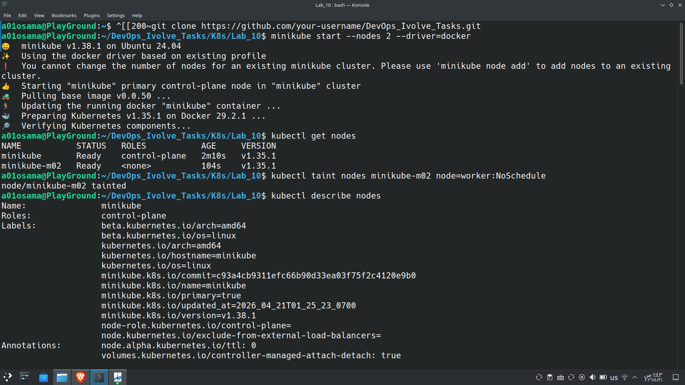
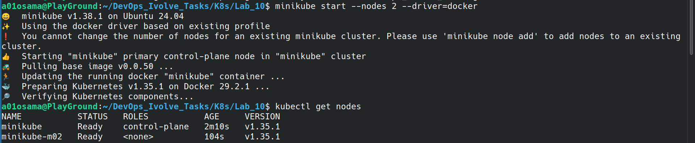
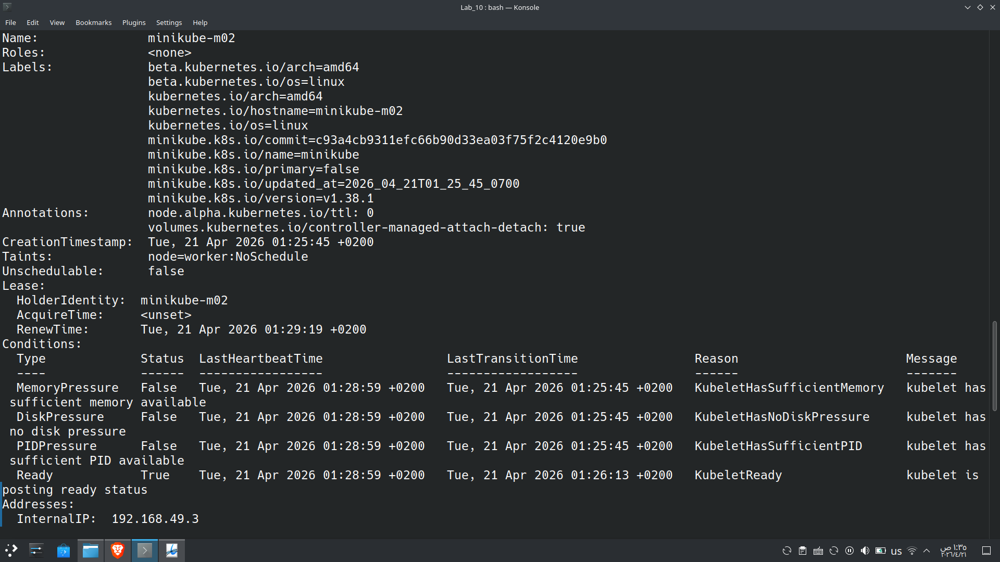

# Lab 10: Node Isolation Using Taints in Kubernetes

## Objective
The objective of this lab is to demonstrate node isolation in Kubernetes using taints. A taint is applied to a worker node to prevent pods from being scheduled on it unless they have a matching toleration.

---

## Environment

* **Kubernetes Cluster:** Minikube
* **Number of Nodes:** 2
* **Kubernetes Version:** v1.34.0
* **Container Runtime:** containerd

---

## Steps

### Step 1: Start the Cluster with 2 Nodes
Start a minikube cluster with 2 nodes:

```bash
minikube start --nodes 2 --driver=docker
```



---

### Step 2: Verify Cluster Nodes
Check that the cluster is running with two nodes:

```bash
kubectl get nodes
```



---

### Step 3: Apply Taint to Worker Node
Taint the worker node with key-value `node=worker` and effect `NoSchedule`:

```bash
kubectl taint nodes minikube-m02 node=worker:NoSchedule
```

---

### Step 4: Verify the Taint
Describe all nodes to confirm the taint was applied:

```bash
kubectl describe nodes
```


