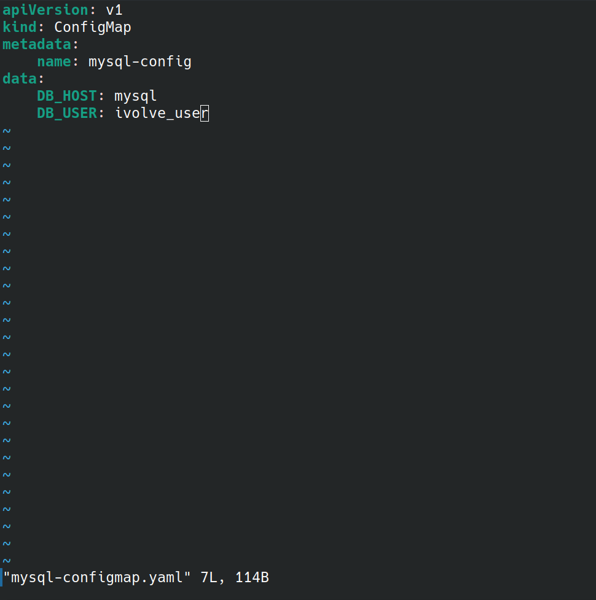
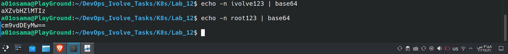
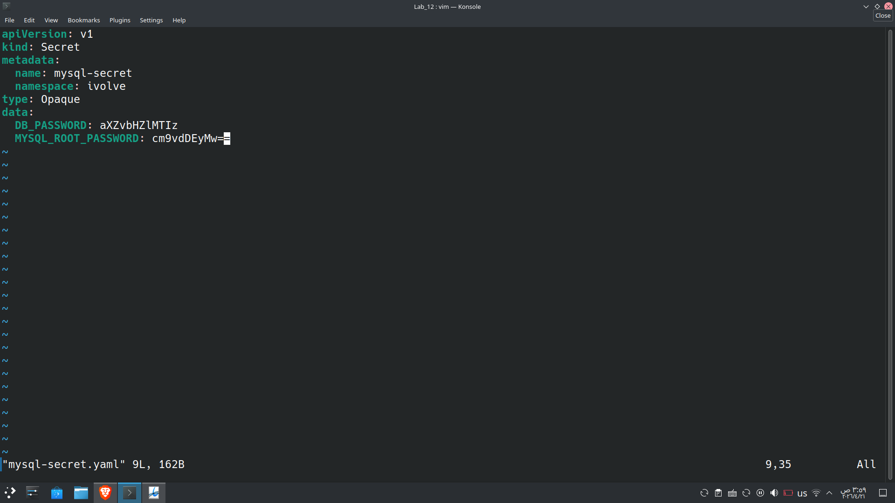
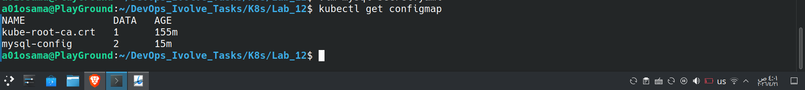
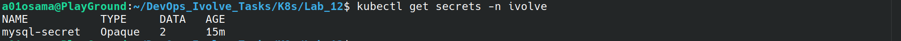
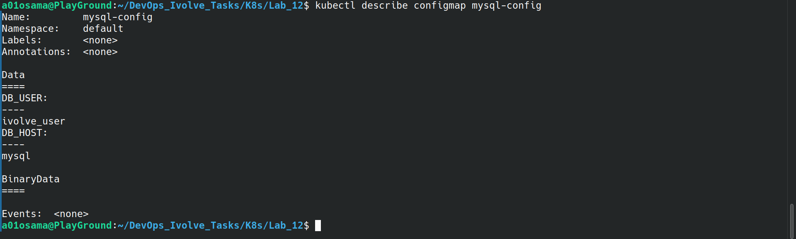
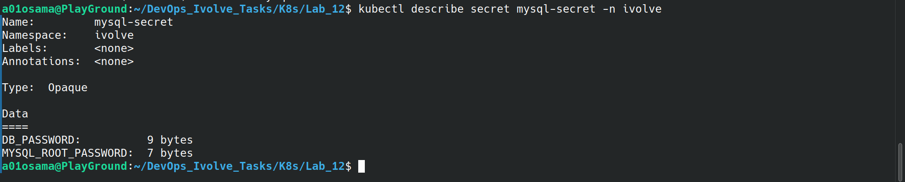

# Lab 12: Managing Configuration and Sensitive Data with ConfigMaps and Secrets

## Objective
The objective of this lab is to manage application configuration and sensitive data in Kubernetes using ConfigMaps and Secrets.

**Non-Sensitive Data (ConfigMap)**
* `DB_HOST` – Hostname of the MySQL StatefulSet service
* `DB_USER` – Database user used by the application to connect to the ivolve database

**Sensitive Data (Secret)**
* `DB_PASSWORD` – Password for the database user
* `MYSQL_ROOT_PASSWORD` – Root password for the MySQL database

---

## Environment

* **Kubernetes Cluster:** Minikube
* **Number of Nodes:** 2
* **Kubernetes Version:** v1.35.0
* **Container Runtime:** containerd
* **Namespace:** ivolve

--

## Steps

### Step 1: Create the ConfigMap
A ConfigMap was created to store non-sensitive MySQL configuration values.

```bash
vim mysql-configmap.yaml
```



```bash
kubectl apply -f mysql-configmap.yaml
```


### Step 2: Encode Sensitive Data Using Base64
Before creating the Secret, encode the sensitive values using base64:

```bash
echo -n ivolve123 | base64
echo -n root123 | base64
```



Expected output:
```
aXZvbHZlMTIz
cm9vdDEyMw==
```


### Step 3: Create the Secret
A Secret was created to store sensitive MySQL credentials securely using the base64 encoded values.

```bash
vim mysql-secret.yaml
```



```bash
kubectl apply -f mysql-secret.yaml
```


---

### Step 4: Verify Resources
Check that both the ConfigMap and Secret were created successfully:

```bash
kubectl get configmap -n ivolve
kubectl get secrets -n ivolve
```




---

Describe both resources to inspect their details:

```bash
kubectl describe configmap mysql-config -n ivolve
kubectl describe secret mysql-secret -n ivolve
```





