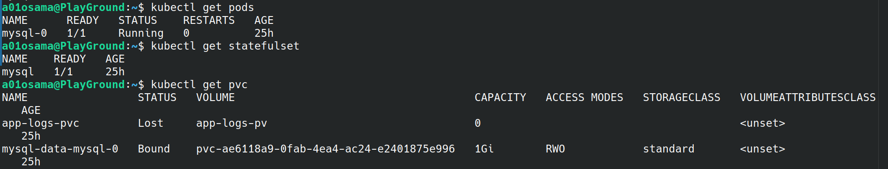

# Lab 14: StatefulSet with Headless Service (MySQL)

## Objective
Deploy a MySQL StatefulSet in Kubernetes with:
- Root password stored in a Secret
- Persistent storage via PVC
- Toleration for a tainted `node=worker:NoSchedule`
- Headless service for stable network identity


## Requirements

* Kubernetes cluster (Minikube) running with 2 nodes
* `kubectl` configured
* Node with taint `node=worker:NoSchedule`
* StorageClass available (1Gi PVC)

---

## Steps

### Step 1: Create MySQL Secret

```bash
kubectl create secret generic mysql-secret \
  --from-literal=MYSQL_ROOT_PASSWORD=MyStrongPass123
```

Verify:

```bash
kubectl get secret mysql-secret
```


### Step 2: Create Headless Service

File: `mysql-headless-service.yaml`

```yaml
apiVersion: v1
kind: Service
metadata:
  name: mysql
spec:
  clusterIP: None
  selector:
    app: mysql
  ports:
    - port: 3306
      name: mysql
```

Apply:

```bash
kubectl apply -f mysql-headless-service.yaml
kubectl get svc
```


### Step 3: Create StatefulSet

File: `mysql-statefulset.yaml`

```yaml
apiVersion: apps/v1
kind: StatefulSet
metadata:
  name: mysql
spec:
  serviceName: mysql
  replicas: 1
  selector:
    matchLabels:
      app: mysql
  template:
    metadata:
      labels:
        app: mysql
    spec:
      tolerations:
        - key: "node"
          operator: "Equal"
          value: "worker"
          effect: "NoSchedule"
      containers:
        - name: mysql
          image: mysql:5.7
          ports:
            - containerPort: 3306
          env:
            - name: MYSQL_ROOT_PASSWORD
              valueFrom:
                secretKeyRef:
                  name: mysql-secret
                  key: MYSQL_ROOT_PASSWORD
          volumeMounts:
            - name: mysql-data
              mountPath: /var/lib/mysql
  volumeClaimTemplates:
    - metadata:
        name: mysql-data
      spec:
        accessModes:
          - ReadWriteOnce
        storageClassName: standard
        resources:
          requests:
            storage: 1Gi
```

Apply:

```bash
kubectl apply -f mysql-statefulset.yaml
```


### Step 4: Verify Resources

```bash
kubectl get pods
kubectl get statefulset
kubectl get pvc
kubectl get svc
```

Expected:
* Pod: `mysql-0` → `Running`
* StatefulSet: `1/1`
* PVC: `Bound`
* Service: `ClusterIP=None`



---

### Step 5: Connect to MySQL

```bash
kubectl exec -it mysql-0 -- mysql -u root -p
```

Password: `MyStrongPass123`

```sql
SHOW DATABASES;
```

Expected output:
```
+--------------------+
| Database           |
+--------------------+
| information_schema |
| mysql              |
| performance_schema |
| sys                |
+--------------------+
```

Exit MySQL:

```sql
EXIT;
```


---


