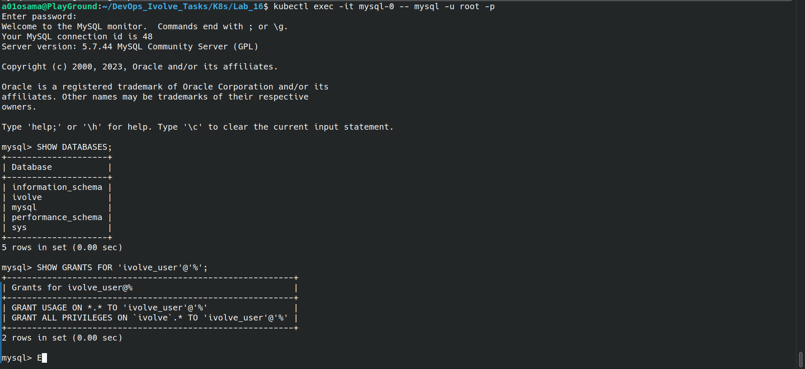
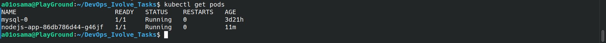

# Lab 16: Kubernetes Init Container for Pre-Deployment Database Setup

## Objective

Configure a Node.js Deployment in Kubernetes with an Init Container to:

- Create the `ivolve` database
- Create `ivolve_user`
- Grant all privileges on `ivolve`
- Use Secret for MySQL credentials
- Use ConfigMap for database configuration
- Ensure the application starts only after database setup completes

---

## Requirements

- Kubernetes cluster running (Minikube or multi-node cluster)
- `kubectl` configured
- Existing MySQL StatefulSet from previous lab
- Existing Node.js deployment from Lab15
- Existing PVC:

```yaml
nodejs-pvc
```

- MySQL Secret:

```yaml
mysql-secret
```

- ConfigMap:

```yaml
nodejs-config
```

---

## Steps

### Step 1: Verify Existing Resources

Check MySQL and storage resources:

```bash
kubectl get pods
kubectl get pvc
kubectl get svc
```

Expected:

- `mysql-0` Running  
- `nodejs-pvc` Bound

---

### Step 2: Update Deployment

File:

```bash
deployment.yaml
```

Add Init Container:

```yaml
initContainers:
- name: init-mysql
  image: mysql:5.7
```

Functions performed:

- Wait for MySQL readiness
- Create database
- Create user
- Grant privileges

Apply:

```bash
kubectl apply -f deployment.yaml
```

---

### Step 3: Verify Pod Startup

Check pod status:

```bash
kubectl get pods
```

Expected:

```bash
Init:0/1
Init:Completed
Running
```

The application container should start only after the Init Container finishes.

---

### Step 4: Check Init Container Logs

```bash
kubectl logs nodejs-app-86db786d44-g46jf -c init-mysql
```

Expected output:

```text
Waiting for MySQL...
Creating database and user...
```

---

### Step 5: Verify Database Setup

Connect to MySQL:

```bash
kubectl exec -it mysql-0 -- mysql -u root -p
```

Password:

```bash
MyStrongPass123
```

Check database:

```sql
SHOW DATABASES;
```

Expected:

```text
ivolve
```

Verify privileges:

```sql
SHOW GRANTS FOR 'ivolve_user'@'%';
```

Expected:

```sql
GRANT ALL PRIVILEGES ON ivolve.*
```

---



### Step 6: Verify Application

Check deployment:

```bash
kubectl get deployment
```

Check pods:

```bash
kubectl get pods
```

Expected:

- Init container completed
- Node.js pod running
- Deployment available

---


