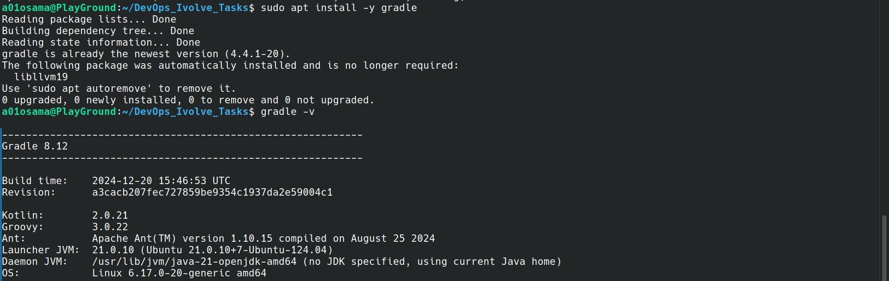
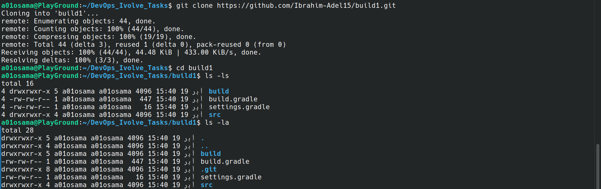
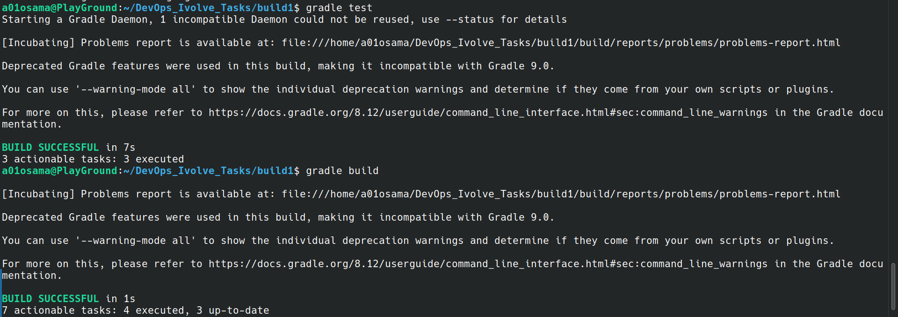
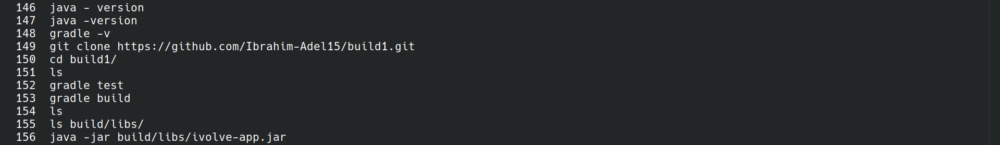
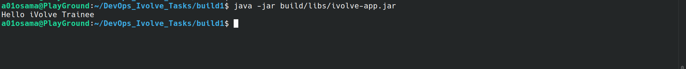

# Lab 1: Java Application Build with Gradle

This project demonstrates how to build, test, and package a Java application using Gradle on a Linux environment (WSL).

---

## Commands

```bash
# Install Gradle
sudo apt update
sudo apt install gradle -y
gradle -v
```



---

```bash
# Clone the source code
git clone https://github.com/Ibrahim-Adel15/build1.git
cd build1
```



---

```bash
# Run Unit Tests
gradle test

# Build the App (generate JAR artifact)
gradle build
```



---

```bash
# Run the App
java -jar build/libs/ivolve-app.jar

# Verify App is working
curl http://localhost:8080
```

---

## Build Success



---

## Application Running


